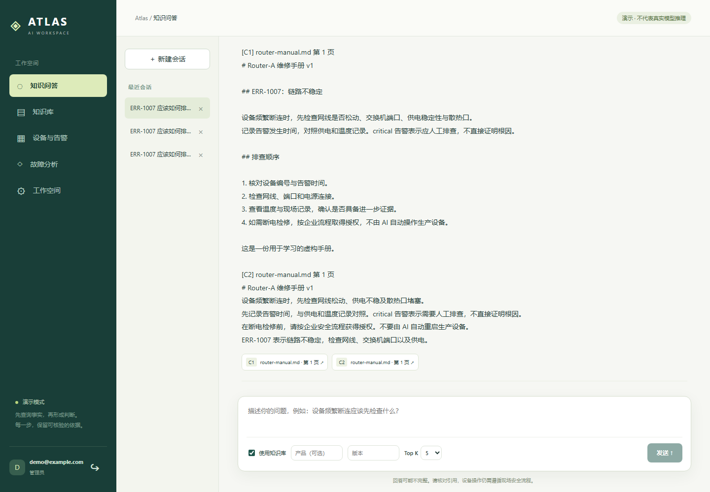
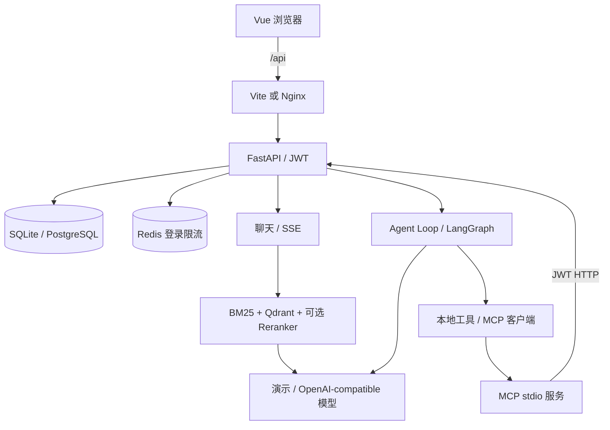

# Atlas AI · 企业设备故障助手

把设备登记、告警和维修手册连起来：登录 → 上传资料 → 带来源问答 → Agent 查询设备与告警 → 给出排查方向。

这是面向学习和小规模演示的完整应用。默认离线演示模式便于先理解代码；真实模型、PostgreSQL、Redis、Qdrant 服务均通过配置接入。**演示回答是确定性模板，演示向量是词法哈希，不代表真实推理或语义检索效果。**

## 十分钟启动（Windows / PowerShell）

准备 Python 3.12+、uv、Node.js 22.12+、pnpm 11。第一次安装需要网络。

第一个终端：

```powershell
cd E:\Codes\atlas-ai\backend
uv sync --locked
uv run python -m app.cli init --email you@example.com --demo
# 按提示设置至少 12 字符的密码；没有默认密码。
uv run fastapi dev app/main.py
```

第二个终端：

```powershell
cd E:\Codes\atlas-ai\frontend
pnpm install --frozen-lockfile
pnpm dev
```

打开 http://127.0.0.1:5173，用刚设置的账户登录。后端接口文档：http://127.0.0.1:8000/docs 。首次初始化用 `--demo` 会增加虚构 Router-A、三条告警和一份手册，不清空已有设备。

先在“知识问答”输入“ERR-1007 应该如何排查？”，点击来源核对原文；再到“故障分析”选择 Router-A，运行“逐步循环”，把“数据连接”换成 MCP 后再运行一次。



## 已实现

- 账户登录、Argon2 密码、JWT、管理员/成员权限、登录限流。
- 设备 CRUD、告警、会话和消息持久化；默认 SQLite，也支持 PostgreSQL。
- Vue 3 + TypeScript + Pinia；SSE 流式回答、停止生成、历史会话与引用预览。
- PDF/TXT/Markdown 上传、分块、重建、删除、原文下载；资料按账户隔离。
- Qdrant 检索、产品/版本筛选、Top-K、BM25 + 向量的 RRF 融合；可选本地 CrossEncoder 重排。
- 手写 Agent Loop 和 LangGraph；工具白名单、参数验证、轮数/超时限制、运行记录。
- MCP stdio 服务通过 JWT 调用 Device API；三种只读工具，不控制真实设备。
- Docker Compose + Nginx；Ollama/vLLM 配置、性能测量脚本与排障手册。

## 架构



## 从哪里读、从哪里改

先读 [45 天代码导读](docs/QUICKSTART-45.md)，每天运行一个结果，再改一处代码。

- `backend/app/main.py`：生命周期、路由、中间件、异常装配，不堆业务。
- `backend/app/core/settings.py`：统一配置；复制 `backend/.env.example` 为 `.env` 后修改。
- `backend/app/api/routes/`：HTTP；`schemas/`：输入校验；`services/`：业务；`models/`：持久化。
- `frontend/src/components/`：每个主要页面一个组件；`api.ts` 管请求和 SSE。
- [模块地图](docs/index.md)、[维护说明](docs/MAINTENANCE.md)、[Docker/Linux 部署](docs/DEPLOYMENT.md)、[本地模型与 GPU](docs/LOCAL-MODELS.md)。

原 180 天教程保留在 `docs/tutorial/`，作为补课资料；Day 14～19、21 的数据库练习保留在 `backend/exercises/`。旧 User 教学表与新 Account 登录表分开，原有数据库文件未清空。旧固定 Token 已停用，所有业务页面需要真实登录。

## 检查

```powershell
cd E:\Codes\atlas-ai\backend
uv run pytest -q
uv run ruff check app tests --select F
cd ..\frontend
pnpm test
pnpm build
```

当前自动化覆盖权限与数据隔离、文档索引、引用、流式错误恢复、Agent 两种执行器、模型协议与设备持久化。真实云 API、GPU 推理和 Docker 服务需在具备对应环境时按部署手册验收；演示测试不能证明回答质量。

## 当前边界

单后端 worker；文档索引同步执行，单文件 5 MB、每账户 100 份文档、单次检索最多 10,000 个候选块。扫描 PDF 需要先 OCR。`create_all` 只创建缺失表，修改已有表结构需显式迁移。文档、会话、分析记录按账户隔离；设备/告警是全工作空间共享资料。这里只做只读故障分析，结果需要核对证据，未接生产设备控制。
