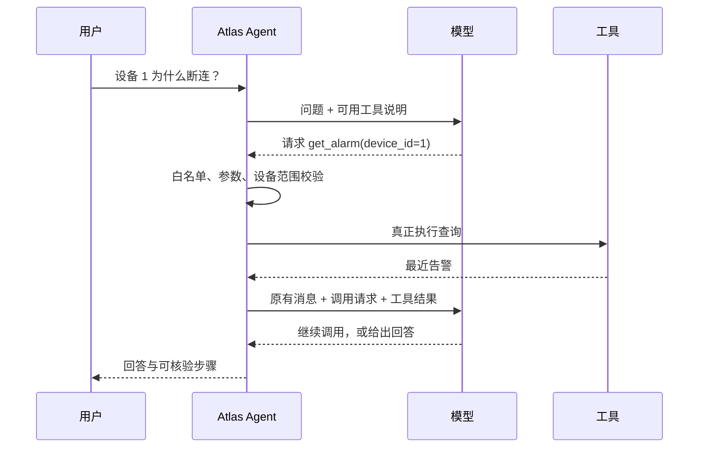

# 课前准备：先看清谁负责什么

## 1. 用前端经验理解整个任务

如果用户点了“查看设备”按钮，你可能写：

```typescript
const device = await api.get(`/devices/${deviceId}`)
```

按钮的点击事件决定调用哪个接口。Agent 场景里，用户说的是“这台设备为什么断连”，没有点一个具体查询按钮。程序把可用工具的说明交给模型，让模型提出下一步要查询什么。

但调用权限仍在程序手里。模型返回 `get_device(device_id=1)` 的结构化请求后，你的 Python 代码验证它，再真正查询。

这一阶段只有 4 块：

- **Tool Calling**：模型用结构化数据表达“我想调用哪个工具，传什么参数”。
- **Agent Loop**：反复把工具结果交回模型，直到回答或触发停止条件。
- **LangGraph**：把循环和分支写成显式节点与边，组织执行顺序。
- **MCP**：让应用通过标准协议发现、调用另一个进程/服务提供的工具。

Tool Calling 和 MCP 处在不同位置。模型 API 的 `tool_calls` 不是发给 MCP 服务的原始报文；中间有应用代码做校验、格式转换和调用。



## 2. 准备实验终端

在本教程文件夹打开 PowerShell。先设置两个变量：

```powershell
$Lesson = (Get-Location).Path
$Py = 'E:\Codes\atlas-ai\backend\.venv\Scripts\python.exe'
$env:PYTHONIOENCODING = 'utf-8'
& $Py --version
& $Py -c "from importlib.metadata import version; print('langgraph', version('langgraph')); print('mcp', version('mcp')); print('pydantic', version('pydantic'))"
```

`&` 是 PowerShell 的调用运算符：执行变量 `$Py` 指向的程序。教程复用 Atlas 已安装的依赖；默认实验不会导入 Atlas 的数据库模块，也不写你的 app.db。

如果 `.venv` 不存在，先打开另一个终端：

```powershell
cd E:\Codes\atlas-ai\backend
uv sync --locked
```

然后回到教程目录。不要在系统 Python 里重复安装一套不同版本。若项目在别的盘，改 `$Py` 即可。

第一条实验命令：

```powershell
& $Py "$Lesson\labs\learn.py" --day 17
```

应该看到虚构设备、告警和工具说明。若出现 `No module named pydantic`，先检查 `$Py`，不是先怀疑实验业务逻辑。

## 3. 这几种 Python 写法先认一下

`async def f()` 类似 TypeScript 的 `async function f()`。调用得到可等待对象；写 `await f()` 才等待结果。`asyncio.run(main())` 相当于脚本启动异步主流程，不要在已运行的 FastAPI 异步端点里再套一层。

`dict` 对应常见 JS 对象；`list` 对应数组。`json.loads(text)` 对应 `JSON.parse(text)`；`json.dumps(value, ensure_ascii=False)` 对应 `JSON.stringify(value)`，额外保证中文可读。

`function(**arguments)` 会把字典展开成具名参数：

```python
arguments = {"device_id": 1, "limit": 3}
get_alarm(**arguments)
# 等价于 get_alarm(device_id=1, limit=3)
```

这不意味着可以把任意字典直接交给任意函数。Day 17 先校验，随后才展开。

`TypedDict` 主要给类型检查器描述字典结构，和 TS interface 相近；它不会自动验证网络返回。`Pydantic BaseModel` 则会实际执行输入校验。不要把两者当同一个东西。

## 4. 文件阅读顺序

实验先读 `labs/tools_lab.py`，再读 `labs/learn.py`。Day 23 才看 `device_server.py` 与 `mcp_lab.py`。Day 24 看 `atlas_probe.py`。

项目源码按顺序读：

1. `E:\Codes\atlas-ai\backend\app\schemas\platform.py`
2. `E:\Codes\atlas-ai\backend\app\services\tools.py`
3. `E:\Codes\atlas-ai\backend\app\services\agent.py`
4. `E:\Codes\atlas-ai\backend\app\services\agent_graph.py`
5. `E:\Codes\atlas-ai\backend\app\mcp_server.py`
6. `E:\Codes\atlas-ai\backend\app\services\mcp_client.py`
7. `E:\Codes\atlas-ai\backend\app\api\routes\agent.py`

今天只要求能指着总图说出“是谁执行 Python”。答案是应用/工具服务，模型只是提出请求。
