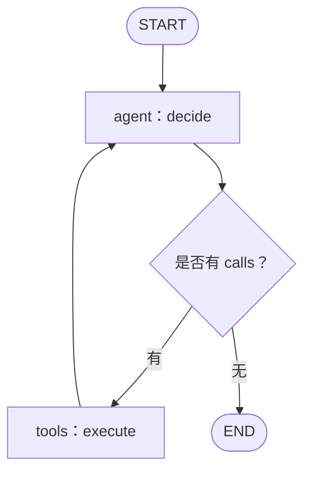

# Day 22：把已有循环表达成图

今天只学习 State、Node、Edge、Conditional Edge。工具、模型适配器和权限规则继续复用昨天的代码。

## 1. 先从已有 while 找图



图里的 agent 就是调用模型并更新 state 的函数；tools 就是校验与执行工具的函数。节点名称是程序员选的普通字符串，不会因为叫 agent 就自动具备任何智能。

## 2. State：节点间流转的工作记录

```python
class AgentState(TypedDict):
    messages: list[dict]
    steps: list[dict]
    iterations: int
    calls: list[dict]
    answer: str
```

它对应 Day 20 的普通字典，没有新增复杂业务。TypedDict 帮助描述键与类型，不等同于运行时验证外部数据；模型参数仍走 Pydantic。

LangGraph 的 state 更新可以按字段使用 reducer；本项目没有设置自定义追加 reducer，因此返回的新字段值覆盖旧值。这个语义与框架定义一致。[Graph API 官方说明](https://docs.langchain.com/oss/python/langgraph/graph-api)

## 3. Node：接受 state，返回更新

```python
builder = StateGraph(AgentState)
builder.add_node("agent", decide)
builder.add_node("tools", execute)
```

add_node 只是注册函数，不是此刻执行。传的是函数对象 decide，不是 `decide()` 的调用结果。

项目的 decide/execute 已经自己创建完整新列表。例如 `messages=old_messages + [response]`。如果又在状态定义中添加“自动追加 messages”的 reducer，就可能把已经包含旧历史的整段列表再追加一遍，造成重复消息。先保持一种更新策略，不要机械拼贴其他教程的 MessagesState。

## 4. Edge：固定下一站

```python
builder.add_edge(START, "agent")
builder.add_edge("tools", "agent")
```

第一条规定入口，第二条规定工具执行后回到模型。固定边不看业务条件。

START 和 END 是框架约定的流程边界，不需要你给它们再写一个节点函数。

## 5. Conditional Edge：看状态决定下一站

```python
builder.add_conditional_edges(
    "agent",
    lambda s: "tools" if s["calls"] else "end",
    {"tools": "tools", "end": END},
)
```

三个参数依次是：从哪个节点出发；用哪个函数判断；判断结果映射到哪个目标。

把 lambda 展开就容易读了：

```python
def choose_next(state):
    if state["calls"]:
        return "tools"
    return "end"
```

这里字符串 `end` 是我们给分支起的标签，通过映射指向框架 END；它并不是自动存在的名叫 end 的业务节点。

## 6. 编译，再运行

```python
graph = builder.compile()
result = await graph.ainvoke(
    initial_state,
    config={"recursion_limit": max_iterations * 2 + 4},
)
```

compile 把图定义变成可执行流程，并做结构检查；它不会把 Python 编译成更聪明的模型。ainvoke 的 a 表示异步调用。

`recursion_limit` 限制图执行步数，不是“模型允许调用几次工具”。agent/tools 两个节点往返要占多个图步，所以项目为图设置更宽的保护额度，同时在 decide 里保留业务的 max_iterations。不能仅靠 recursion_limit 表达业务轮数。

## 7. 运行对照实验

```powershell
& $Py "$Lesson\labs\learn.py" --day 20
& $Py "$Lesson\labs\learn.py" --day 22
```

在同一个固定模拟器下，两者都应该得到 3 个工具步骤、4 次模型响应，以及相同类型的结束结果。真实模型输出有随机性，不要求两次回答逐字相同。

读 `labs/learn.py` 的 run_loop 和 run_graph，确认只换了流程组织，make_nodes、工具与模型接口保持一致。

再到 Atlas 页面，把执行方式从“逐步循环”切换“图工作流”，数据连接仍用“应用内工具”。成功后再做 Day 24 的 MCP 组合，避免同时改两项时不知道问题出在哪。

## 8. 没有自动获得的能力

当前 `builder.compile()` 没传 checkpointer，state 在这次内存运行中流转；持久化的是路由保存的 AgentRun 结果。没有自动提供跨进程恢复、人工审批暂停、长期记忆。LangGraph 可以承载更复杂的设计，但使用两个节点不代表已经实现那些能力。

**小练习：** 在纸上把“有 calls 走 tools”反过来，预测会发生什么，再恢复。错误分支会让任务在该调用工具时结束，或者无意义地循环。先学会读图，就能定位这类问题。

**验收：** 不看代码画出四条关系：START→agent、agent→tools、tools→agent、agent→END；说明条件判断在哪里、轮数保护在哪里。
