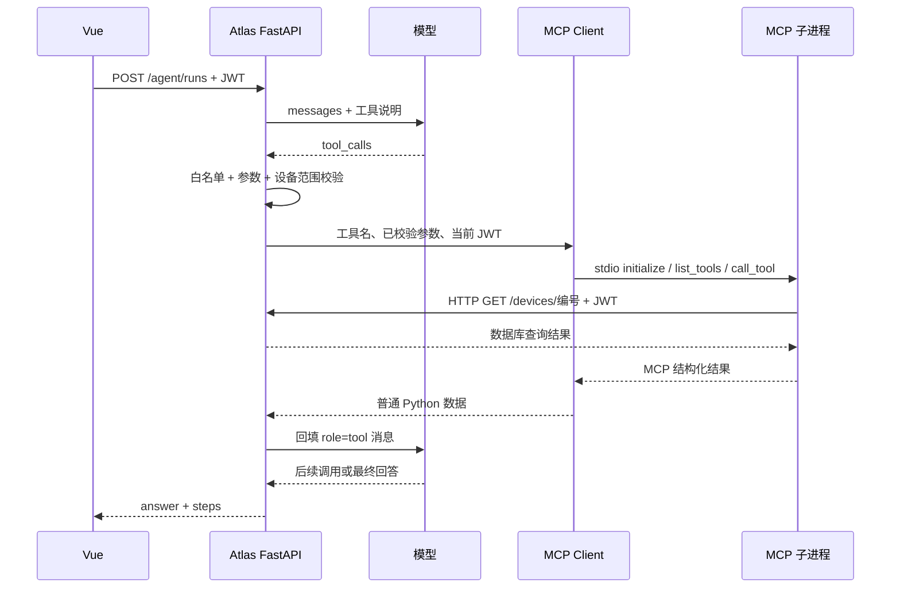

# Day 24：Agent → MCP → Device API

今天把虚构内存工具换成 Atlas API。完成后能从页面提出设备问题，沿着整条调用链定位请求与结果。

## 1. 先画清两段通信



图里 API 出现了两次职责：接收用户发起的分析任务，也提供内部查询接口。MCP 服务访问的是受认证保护的 API，不是绕过应用规则去连接数据库。

第一段是 Agent 的 MCP client → 子进程，走 stdio。第二段是子进程 → FastAPI，走 HTTP。这不是一个“HTTP MCP 服务”，不要把两段连接混成一个协议。

## 2. 先启动 Atlas

若还没有管理员和示例数据，停止后端后，在后端目录运行：

```powershell
cd E:\Codes\atlas-ai\backend
uv run python -m app.cli init --email you@example.com --demo
```

使用你自己的邮箱和密码。已有账户不会被重置。先停服务是因为本地 Qdrant 目录不能被两个进程同时打开；这不是让你删除数据库。

第一个终端启动后端：

```powershell
cd E:\Codes\atlas-ai\backend
uv run fastapi dev app/main.py
```

第二个终端启动前端：

```powershell
cd E:\Codes\atlas-ai\frontend
pnpm dev
```

页面 http://127.0.0.1:5173 。先登录，确认设备列表、告警、知识库能分别查看。设备编号请从实际列表/API 确认，**不要假定 Router-A 永远是 1**；已有数据库可能分配别的 ID。

## 3. 先验证单个 MCP 工具，不急着让模型分析

回到教程终端，替换邮箱和实际设备编号：

```powershell
& $Py "$Lesson\labs\atlas_probe.py" --email you@example.com --device-id 1
```

脚本提示输入密码，不把密码放在命令行。它登录获取 JWT，真实调用项目的 MCP 客户端，依次查询设备、告警与手册；默认不创建分析记录。

如果直接连接 FastAPI，URL 是 `http://127.0.0.1:8000`，不带 `/api`。若通过 Nginx，可以传 `--url http://127.0.0.1:8080/api`，代理会去前缀。部署里的 Agent 自身使用什么内部地址，由后端 MCP_API_URL 决定。

项目位置不同可传 `--backend 你的backend绝对路径`。解释器仍应选装了相同依赖的 Python。

## 4. 读服务器代码：JWT 只随 HTTP 请求传递

`app/mcp_server.py` 中的核心函数：

```python
base = os.environ["ATLAS_API_URL"].rstrip("/")
token = os.environ["ATLAS_ACCESS_TOKEN"]
async with httpx.AsyncClient(timeout=15, trust_env=False) as client:
    response = await client.get(
        base + path,
        params=params,
        headers={"Authorization": f"Bearer {token}"},
    )
```

服务本身不内置账户、不自己创造高权限 token。它用发起这次任务的当前用户身份访问 API。token 不需要模型生成，也不出现在工具 arguments 和 messages 中。

`trust_env=False` 对当前内部调用很有用：这个 Windows 环境曾把 localhost 请求送到系统代理，得到 Privoxy 500。直连内部服务后恢复；这不等于为所有互联网请求随意禁用企业代理，而是此处通道的明确配置。

## 5. 读客户端：模型不能选择启动命令

`services/mcp_client.py` 固定使用：

```python
StdioServerParameters(
    command=sys.executable,
    args=["-m", "app.mcp_server"],
    cwd=str(BACKEND_DIR),
    env=controlled_env,
)
```

模型只能从白名单里提出工具名，不能把命令换成任意脚本、把参数改成 shell 命令、把 API 地址改成陌生站点。当前用户 token 通过受控环境交给子进程；环境变量也不是不可见的保险箱，所以不要把它随意打印或交给不受信任程序。

当前实现每次工具调用新建一个短生命周期 MCP 进程。易读、隔离清楚，但三次工具调用会有三次启动/握手开销；将来若优化为持久连接，要处理用户凭证隔离与进程回收，不能简单全局共享最后一个用户的 token。

## 6. 路由与权限分别在哪里

POST /agent/runs 从 JWT 得到当前账户；run_agent 验证当前选择的设备；MCP 服务的 HTTP 请求再次经过 API 的 JWT 校验。

设备/告警是当前工作空间共享只读数据。手册搜索根据 token 所属账户过滤文档。用户 B 通过 MCP 搜索，不会因此自动得到用户 A 的私人手册。

注意，若你手动绕过 Atlas Agent，直接调用 stdio 工具，Agent 层“只能查本次选择的设备”的限制不会凭空出现在 MCP Server 中；最终权限仍以服务端 API 为准。当前共享设备模型允许登录成员读取任意已登记设备。这是现有设计，不是租户隔离实现。

## 7. 四种组合逐个验收

在故障分析页面依次尝试：

1. 逐步循环 + 应用内工具：确认基本业务。
2. 图工作流 + 应用内工具：确认控制流替换。
3. 逐步循环 + MCP 设备服务：确认通信替换。
4. 图工作流 + MCP 设备服务：确认组合链路。

问同一句话：“这台设备最近频繁断连，应该如何排查？”演示模式一般能看到查询设备、查询告警、检索手册三个步骤。每一步都展开核对 `result.ok` 和 data，而不是只看顶部完成状态。

如果希望从终端创建一条完整分析任务：

```powershell
& $Py "$Lesson\labs\atlas_probe.py" --email you@example.com --device-id 1 --run-agent --engine loop
& $Py "$Lesson\labs\atlas_probe.py" --email you@example.com --device-id 1 --run-agent --engine graph
```

`--run-agent` 会写入你自己的分析历史，并调用后端当前配置的模型。项目 LLM_MODE=demo 时还是固定演示；切到 compatible 并验证真实工具调用后，才能说真实模型参与了决策。

## 8. 本地工具与 MCP 结果不要求逐字节相同

它们应满足相同业务目的，但当前返回字段有小差异：本地 get_device 多一个 note，HTTP get_alarm 多 device_id；同时间告警的次级排序也可能不同。比较时看设备身份、核心记录和权限，不要假定两个传输的 JSON 必须完全相等。

若将来需要完全一致，应抽出共享响应 schema/序列化函数，而不是让前端逐个猜字段。教程没有悄悄把项目实现改成一个不存在的统一契约。

## 9. 根据症状定位

**401**：未登录、JWT 过期、签名配置变化；重新登录后再试，不要改成固定万能 token。

**403**：账户角色不足；普通成员不能写设备/告警，读接口应可用。

**404**：实际设备编号不存在；看列表后替换命令里的 ID。

**MCP Connection closed**：子进程启动异常、Python 环境不一致、导入包失败、SDK 主版本不兼容。先读 stderr，确认 `mcp<2` 和正确解释器。

**500 Internal Privoxy Error**：内部调用被代理接管；核对项目 request 中的 trust_env=False，区分模型互联网请求的代理需求。

**Extra data / JSON 解析错**：多条返回被拆成文本 JSON；检查结构化输出注解，不能只用一条数据测通。

**空手册数组**：先查当前账户是否有资料、状态是否 ready、模型切换后是否重建索引。没有结果与检索失败分开判断。

**耗时超限**：先看哪个步骤慢，再区分模型等待、MCP 启动和 HTTP 查询；不要一开始把所有 timeout 改成无限。

## 10. 最终验收

完成一次有证据的分析后，自己解释：哪项来自数据库，哪项来自手册，哪项只是推测；更换账户后哪些资料变化；模型请求多次是为什么；MCP 的哪一段走 stdio、哪一段走 HTTP。

你此时拥有的是完整的只读故障分析链路。自动重启设备、人工审批、可恢复长任务属于后续功能，不应因为今天跑通就宣称已经实现。
